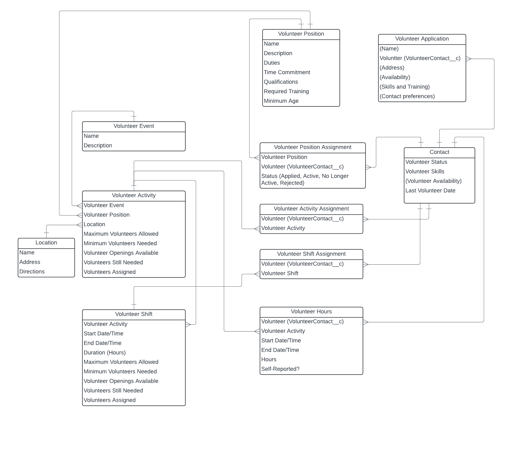

## Data Model

### Definitions
* **Volunteer Positions** are job listings. They include a description of the job, duties, qualifications and other requirements needed to volunteer in a given role.
* **Volunteer Activities** are things that a volunteer who is qualified for a certain position can do. They aren't directly tied to a certain time, but they can contain one or more shifts.
* **Volunteer Shifts** capture time slots that require a certain number of volunteers to come together at a certain time to do a certain type of work.
* **Volunteer Events** group a collection of activities. These are useful when coordinating many volunteers filling multiple positions for the same event.
* **Volunteer Applications** are like job applications. (This is represented on the ERD but has not been built out or included in the sample scenarios yet.) 

We'll see more about how these objects are put to use in [Data Model in Context](#data-model-in-context) after we introduce some sample scenarios.

If you'd like to skip the narrative, you can go directly to [Entity Relationships](#entity-relationships).

## Sample Data Scenarios

### Toe Beans Animal Shelter

The animal shelter sample dataset contains info about a fictional animal shelter, Toe Beans Animal Rescue. Toe Beans has a mix of administrative, event, and shelter volunteers across three main locations. 

We'll follow along with a few fictional volunteers and staff:

Brianna Jacobsen is the volunteer manager for Toe Beans. She's responsible for reviewing applications, making sure new volunteers complete the appropriate training, and ensuring that all volunteer activities are appropriately staffed.

Charlotte Scott is a dog walker. She typically comes in Thursday afternoons but occasionally fills in for other shifts when the minimum number of volunteers hasn't been met.

Daniel Jackson has been helping the marketing lead at Toe Beans design a new microsite for their upcoming annual event, Toe Beans on Parade. He enters his volunteer hours once a month but mostly works on his own schedule.

Mia Davis is a long-time volunteer who can do it all. She comes in most Tuesdays to do data entry in the office. She knows the organization well and occasionally helps out with volunteer training or processing adoptions. She's also happy to take a shift playing with kittens at the cat shelter as needed.

### Data Model in Context

Let's take a look at how we might see different types of data appear in our data model with the animal shelter example:

### Volunteer Positions

Here are the names of some Volunteer Positions we might see:
* Dog Walker
* Cat Care Assistant
* Administrative Assistant

Let's take a look at some data we'd find on the Administrative Assistant record:

* Volunteer Position Name: Administrative Assistant
* Location: Toe Beans Animal Rescue - Main Office
* Status: Open
* Description: Administrative assistants at Toe Beans Animal Shelter will input and manage vital information regarding shelter animals, adoptions, donations, and volunteers to ensure accurate and up-to-date records that support the shelter’s operations and outreach efforts.
* Duties: Administrative assistants will be responsible for entering and updating data in the shelter’s databases, verifying the accuracy of information, generating reports, and maintaining confidential records. They will assist with tracking animal intake and adoptions, donor contributions, and volunteer hours.
* Time Commitment: Flexible
* Qualifications: Candidates should possess strong attention to detail, excellent typing skills, and proficiency in Microsoft Office and database software. Previous experience in data entry or administration is preferred but not required. Volunteers should be comfortable working with computers, able to manage sensitive information discreetly, and have good organizational skills. A commitment to accuracy and a passion for animal welfare are essential.
* Required Training: Volunteers will complete an initial orientation covering the shelter’s mission, policies, and data entry protocols. Training will include hands-on instruction in using the shelter’s database software, data entry standards, and privacy guidelines. Ongoing support and periodic training sessions will be provided to ensure volunteers remain proficient and up-to-date with any system changes.
* Minimum Age: 18

This is the job listing that prospective volunteers would see before they become an Administrative Assistant volunteer. 

### Volunteer Activities

Activities are the jobs that volunteers interact with once they've been accepted into the volunteer program. They don't inherently have times associated with them, but they can have one or more shifts associated with them.

For activities with flexible timing, volunteers can be directly assigned to the activity. For our Administrative Assistant example, we'd have a volunteer activity for the position. The name of the activity might be similar to the name of the position. In this case, we'll call the activity Data Entry for clarity. Data Entry (the activity) is the job we're asking Mia (the volunteer) to complete as as Administrative Assistant (the position). Volunteers are connected to activities via Volunteer Activity Assignments.

Volunteers are connected to positions via Volunteer Position Assignments.

## Entity Relationships

This is an early draft model. More fields will be added as the product is developed. 

### Standard vs. Custom Objects

This model favors domain-specific custom objects over repurposing standard objects. This avoid collision with other use cases and ensures full support for custom object functionality that may or may not exist in standard objects. 

The following standard objects are used:
* Contact
* Account (Person Account)
* Location

All other objects are custom.

### Contacts vs. Person Accounts

This model is intended to support either modeling volunteers as Contacts or Person Accounts, though not within the same org. All volunteer-related objects contain lookups with both Contact and Account, both labeled Volunteer with API names to disambiguate (VolunteerContact__c or VolunteerAccount__c).