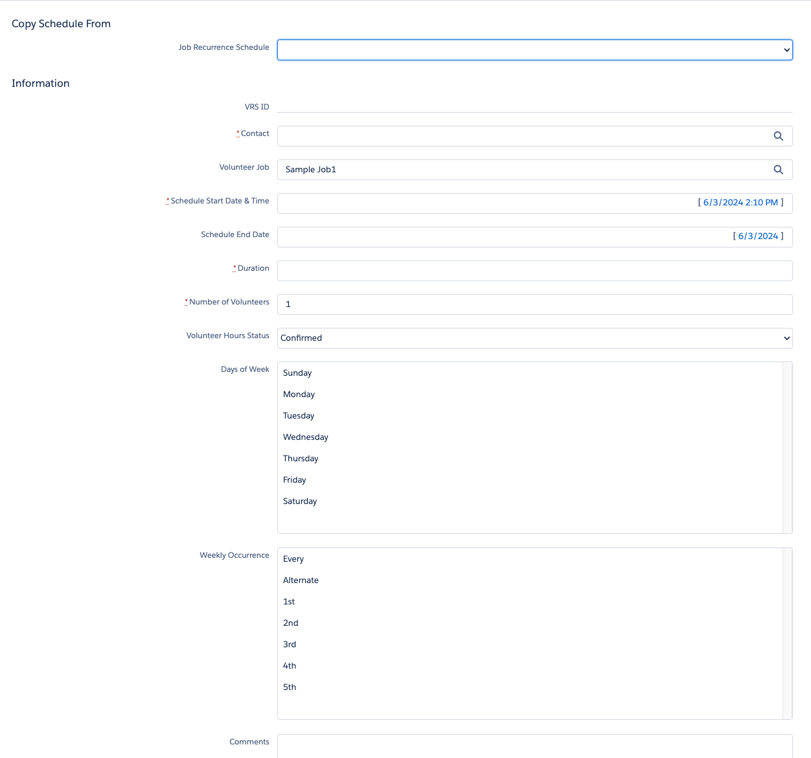

# Features

## List

* [Rollup Calculations](#rollup-calculations)
* [Volunteer Assignment](#volunteer-assignment)
* [Shift Calendar](#shift-calendar)
* [Volunteer Reports & Dashboards](#volunteer-report-dashboards)
* [Volunteer Roster](#volunteer-roster)
* [Mass Email Volunteers](#mass-email-volunteers)
* [Volunteer Recurrence](#volunteer-recurrence)
* [Shift Recurrence](#shift-recurrence)

## Rollup Calculations

### V4S calculations

* Campaign
	* Number of Volunteers
	* Volunteer Completed Hours
	* Volunteer Shifts
	* Volunteers Still Needed
* Volunteer Job
	* First Shift
	* Number of Completed Hours
	* Number of Volunteers Still Needed
	* Number of Volunteers
* Volunteer Shift
	* Total Volunteers
* Contact
	* First Volunteer Date
	* Last Volunteer Date
	* Volunteer Hours

### Volunteers calculations

* Volunteer Activity
	* Volunteers Assigned
	* Total Volunteer Hours
	* First Shift Date/Time
* Volunteer Shift
	* Volunteers Assigned
* Contact/Person Account
	* First Volunteer Date
	* Last Volunteer Date
	* Total Volunteer Hours

## Volunteer Assignment

As a volunteer manager, I can find volunteers who match the qualifications and availability I need to fill open shifts or activities.

### V4S Find Volunteers 

## Shift Calendar

As a volunteer manager, I can see a calendar representation of all volunteer events or shifts.

### V4S Shift Calendar (uses Google Calendar)

## Volunteer Reports & Dashboards

### V4S Reports

* **Active Volunteers** - list of Contacts with Active Volunteer Status
* **Available Volunteer Jobs** - All Volunteer Jobs that are ongoing, or need people.
* **Hours detached from their VRS** - Hours that were originally created by a Volunteer Recurrence Schedule, but no longer match.
* **Inactive Volunteers** - list of Contacts with Inactive Volunteer Status
* **New Sign Ups - Contacts** - list of Contacts with New Sign Up Volunteer Status
* **New Sign Ups - Leads** - list of Leads with New Sign Up Volunteer Status
* **Prospective Volunteers** - list of Contacts with Prospective Volunteer Status
* **Recent Volunteers** - list of volunteers whose last volunteer date or web signup date was in the last 120 days
* **Shifts Detached from their JRS** - Shifts that were originally created by a Job Recurrence Schedule, but no longer match.
* **Top Volunteers by Lifetime Hours** - FOR DASHBOARD: list of total worked hours by volunteer
* **Top Volunteers by Recent Hours** - FOR DASHBOARD: list of total worked hours by volunteer in the specified Time Frame.
* **Unassigned Volunteers** - All Active, Prospective, and New Signup Volunteers who have no current Volunteer Hours assigned.
* **Unique Volunteers** - Summary count of unique volunteers by Campaign and Job
* **Upcoming Shifts Needing Volunteers** - Shifts in the future with unfilled volunteer shifts.
* **Upcoming Shifts with Volunteers** - All upcoming shifts with volunteers. Can be used as a check-in sheet.
* **Upcoming Volunteers** - list of all Volunteers with Hours in the next 30 days
* **Volunteer Hours By Month Matrix** - matrix report that gives you the sum of hours volunteered by month for each volunteer.
* **Volunteer Hours This Year** - Volunteer hours this year, unique and totals (groups).
* **Volunteer Hours by Account/Org** - Total volunteer hours & unique counts for each account/organization.
* **Volunteer Hours by Campaign** - Total of all volunteer hours for volunteer campaigns for all time.
* **Volunteer Hours by Job** - Total of all volunteer hours by unique job name for all time.
* **Volunteer Hours by Month** - Volunteer hours by month for the current year (DASHBOARD)
* **Volunteer Hours for Dashboard** - Total hours worked for the Volunteers Dashboard
* **Volunteer Jobs With Shift Summary** - Lists all Jobs, and their shifts, with summary data.
* **Volunteer Roster** - list of all volunteers for the specified Campaign, Job, and Shift (USED BY ROSTER BUTTONS)
* **Volunteers Daily Roster** - A list of all upcoming Volunteers by day
* **Volunteers Last Month** - FOR DASHBOARD: list of volunteers and their hours from last month
* **Volunteers This Year** - FOR DASHBOARD: Volunteers this year.
* **Volunteers by Account** - list of volunteers grouped by Account
* **Volunteers by Availability** - list of volunteers grouped by their availability.
* **Volunteers by Skill** - list of volunteers, grouped by skills
* **Volunteers with any Volunteer Status** - All volunteers with status set to any value.     

### V4S Volunteers Dashboard

## Volunteer Roster
V4S Volunteer Roster

## Mass Email Volunteers
As a volunteer manager, I can quickly email a list of volunteers. 

This may be volunteers associated with an activity. Example: "The door code to the main office has changed ..."

This may be volunteers associated with a shift. Example: "We're expecting rain on Tuesday, so please bring appropriate gear to the park with you."

This may be volunteers for a given position. Example: "We're looking for trained dog walkers to help with our adoption event next month."

These may be recurring messages that make sense as a template, but many of them will be ad hoc. For MVP, having a way to send ad hoc messages quickly is more important than having nicely formatted templated messages.

### V4S Mass Email Volunteers page

## Volunteer Recurrence
As a volunteer manager, I need a way to assign recurring volunteers to an ongoing series of shifts. Example: "Carol Smith walks dogs every Tuesday at 3 p.m."

### V4S Volunteer Recurrence Schedule 

## Shift Recurrence
As a volunteer manager, I need a way to set up recurring shifts. Example: "I need 3-5 people to walk dogs at 3 p.m. every Tuesday."

### V4S Job Recurrence

### PMM Service Schedule

This is a much nicer way of accomplishing the same goal. Use this as a starting point.
