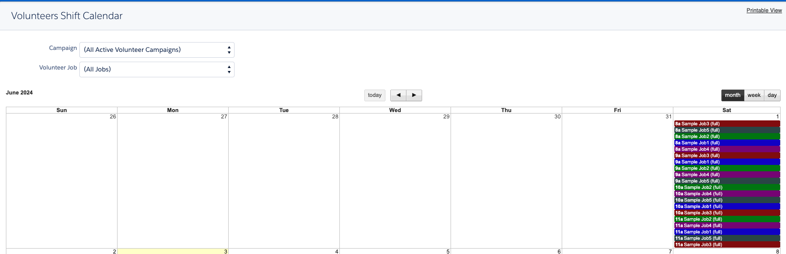

# Features

The goal of the Volunteers project is to complete an MVP version of internal, volunteer manager features of Volunteers for Salesforce by August 2024. Features included in the volunteer portal of V4S or any significant enhancements are out of scope until the MVP goal is complete. This document includes an overview of V4S features for reference as well as a high-level description of how those features might be replaced. While we want to solve the same problems that V4S solved, we may do so in entirely different ways to improve functionality and user experience. This document is an early draft that will evolve over time.

## List

* [Rollup Calculations](#rollup-calculations)
* [Volunteer Assignment](#volunteer-assignment)
* [Shift Calendar](#shift-calendar)
* [Volunteer Reports & Dashboards](#volunteer-report-dashboards)
* [Volunteer Roster](#volunteer-roster)
* [Ad Hoc Email](#ad-hoc-email)
* [Volunteer Recurrence](#volunteer-recurrence)
* [Shift Recurrence](#shift-recurrence)

## Rollup Calculations

### V4S calculations

* Campaign
	* Number of Volunteers
	* Volunteer Completed Hours
	* Volunteer Shifts
	* Volunteers Still Needed
* Volunteer Job
	* First Shift
	* Number of Completed Hours
	* Number of Volunteers Still Needed
	* Number of Volunteers
* Volunteer Shift
	* Total Volunteers
* Contact
	* First Volunteer Date
	* Last Volunteer Date
	* Volunteer Hours

### Volunteers calculations

* Volunteer Activity
	* Number of Volunteers Assigned
	* Number of Completed Hours
	* Total Volunteers Needed
	* Number of Volunteers Still Needed
	* First Shift Date/Time
* Volunteer Shift
	* Total Volunteers Needed
	* Number of Volunteers Assigned
	* Number of Volunteers Still Needed
* Contact/Person Account
	* First Volunteer Date
	* Last Volunteer Date
	* Total Volunteer Hours
	* (Summarize volunteer applications?)

## Volunteer Assignment

V4S Find Volunteers 

## Shift Calendar

V4S Shift Calendar (uses Google Calendar)

## Volunteer Report Dashboards

V4S Reports

V4S report list:

* Active Volunteers | list of Contacts with Active Volunteer Status
* Available Volunteer Jobs | All Volunteer Jobs that are ongoing, or need people.
* Hours detached from their VRS | Hours that were originally created by a Volunteer Recurrence Schedule, but no longer match.
* Inactive Volunteers | list of Contacts with Inactive Volunteer Status
* New Sign Ups - Contacts | list of Contacts with New Sign Up Volunteer Status
* New Sign Ups - Leads | list of Leads with New Sign Up Volunteer Status
* Prospective Volunteers | list of Contacts with Prospective Volunteer Status
* Recent Volunteers | list of volunteers whose last volunteer date or web signup date was in the last 120 days
* Shifts Detached from their JRS | Shifts that were originally created by a Job Recurrence Schedule, but no longer match.
* Top Volunteers by Lifetime Hours | FOR DASHBOARD: list of total worked hours by volunteer
* Top Volunteers by Recent Hours | FOR DASHBOARD: list of total worked hours by volunteer in the specified Time Frame.
* Unassigned Volunteers | All Active, Prospective, and New Signup Volunteers who have no current Volunteer Hours assigned.
* Unique Volunteers | Summary count of unique volunteers by Campaign and Job
* Upcoming Shifts Needing Volunteers | Shifts in the future with unfilled volunteer shifts.
* Upcoming Shifts with Volunteers | All upcoming shifts with volunteers. Can be used as a check-in sheet.
* Upcoming Volunteers | list of all Volunteers with Hours in the next 30 days
* Volunteer Hours By Month Matrix | matrix report that gives you the sum of hours volunteered by month for each volunteer.
* Volunteer Hours This Year | Volunteer hours this year, unique and totals (groups).
* Volunteer Hours by Account/Org | Total volunteer hours & unique counts for each account/organization.
* Volunteer Hours by Campaign | Total of all volunteer hours for volunteer campaigns for all time.
* Volunteer Hours by Job | Total of all volunteer hours by unique job name for all time.
* Volunteer Hours by Month | Volunteer hours by month for the current year (DASHBOARD)
* Volunteer Hours for Dashboard | Total hours worked for the Volunteers Dashboard
* Volunteer Jobs With Shift Summary | Lists all Jobs, and their shifts, with summary data.
* Volunteer Roster | list of all volunteers for the specified Campaign, Job, and Shift (USED BY ROSTER BUTTONS)
* Volunteers Daily Roster | A list of all upcoming Volunteers by day
* Volunteers Last Month | FOR DASHBOARD: list of volunteers and their hours from last month
* Volunteers This Year | FOR DASHBOARD: Volunteers this year.
* Volunteers by Account | list of volunteers grouped by Account
* Volunteers by Availability | list of volunteers grouped by their availability.
* Volunteers by Skill | list of volunteers, grouped by skills
* Volunteers with any Volunteer Status | All volunteers with status set to any value.     

V4S Volunteers Dashboard

## Volunteer Roster
V4S Volunteer Roster

## Ad Hoc Email
V4S Mass Email Volunteers page

## Volunteer Recurrence
V4S Volunteer Recurrence Schedule 

## Shift Recurrence
V4S Job Recurrence

PMM Service Schedule

This is a much nicer way of accomplishing the same goal. Use this as a starting point.